# Terraform

## Check Components on UI

### Provision components

#### Resources Group
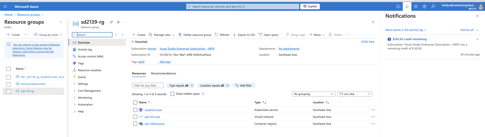

#### AKS Cluster
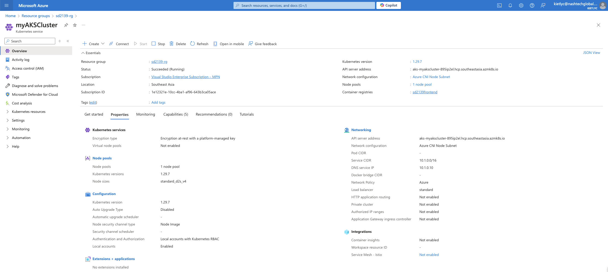

#### ACR

## Azure DevOps

### Continuous Integration

#### Overview
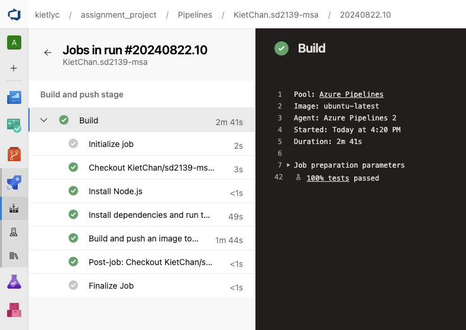

#### Install Node environment
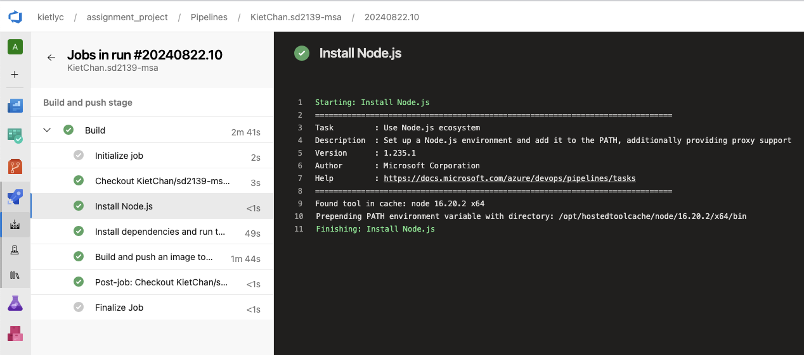

#### Install Dependencies and Run Tests
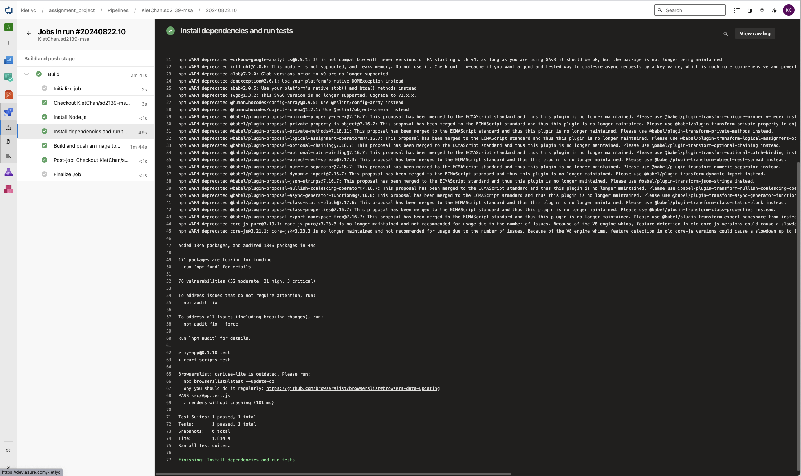

#### Build and Push Docker Image
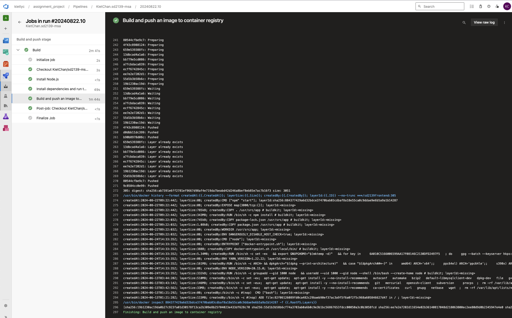

### Continuous Delivery

#### Apply Kubernetes Deployment
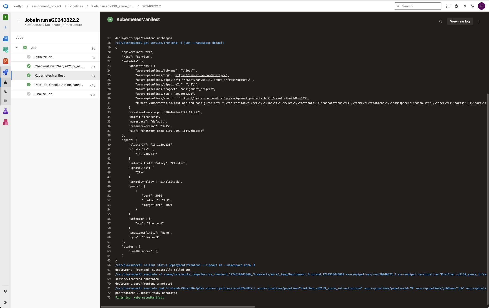

#### UI After Deployment
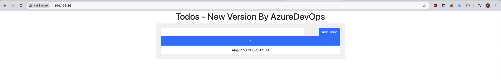

### Prometheus
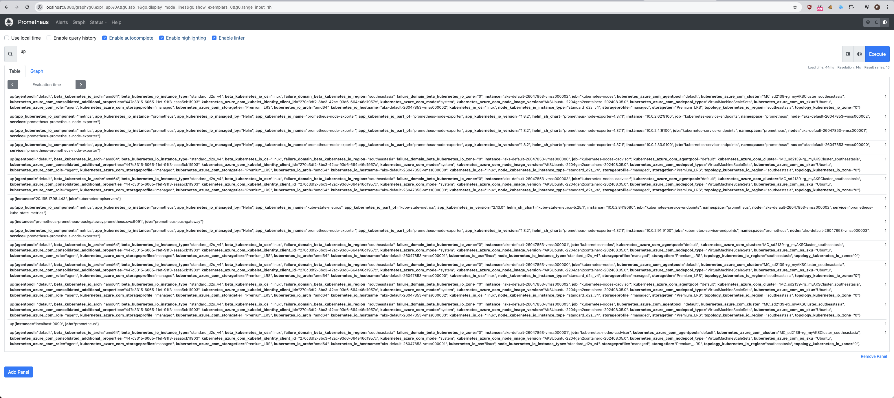

### Grafana
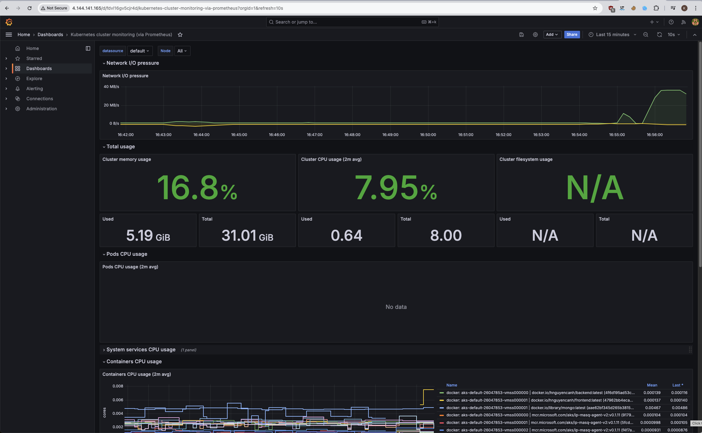
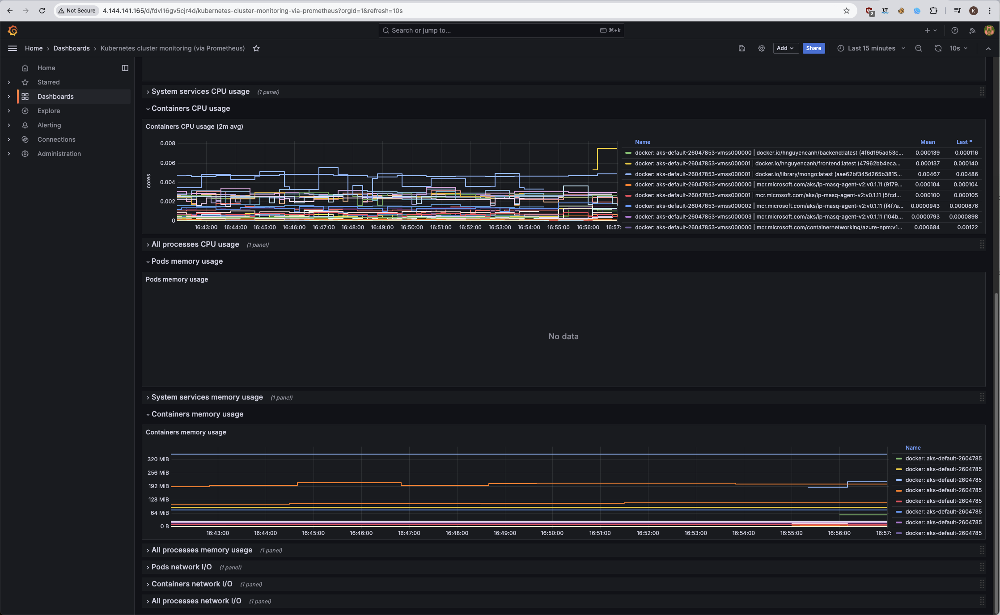